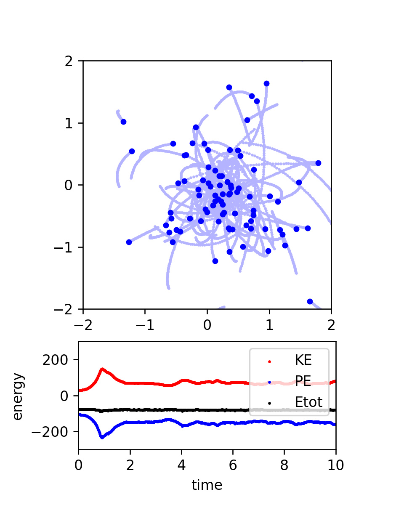

# nbody-python

Vectorized N-body code (Python)

Original Author: Philip Mocz (2020) Princeton Univeristy, [@PMocz](https://twitter.com/PMocz)

Original Repository: https://github.com/pmocz/nbody-python

Modified for use in CMSE 890-401 (Fall 2023) by Claire Kopenhafer, Michigan State University

## Create Your Own N-body Simulation (With Python)

Simulate orbits of stars interacting due to gravity

Code calculates pairwise forces according to Newton's Law of Gravity

**[📝 Read the Algorithm Write-up on Medium](https://medium.com/swlh/create-your-own-n-body-simulation-with-python-f417234885e9)**

To run with the default simulation:
```
python nbody.py
```

The default simulation uses a drift-kick time integrator to update particle positions and velocities and produces the following image:



